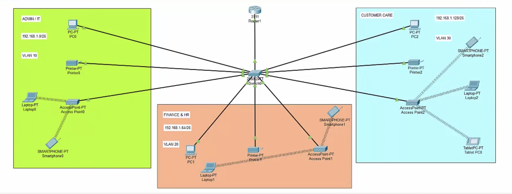

# Enterprise Network Workspace Design

A Cisco Packet Tracer project demonstrating the design and implementation of a small enterprise branch network with VLAN segmentation, DHCP, wireless connectivity, and inter-VLAN communication.

## Network Requirements

- One Cisco Router and One Cisco Switch
- Three Departments:
  - Admin / IT
  - Finance / HR
  - Customer Care / Reception
- Separate VLAN for each department
- Wireless connectivity for users
- Automatic IPv4 address assignment
- Communication between all departments

Base Network: `192.168.1.0/24`

---

## Technologies Used

- Cisco Packet Tracer
- VLANs
- DHCP
- Router-on-a-Stick
- Inter-VLAN Routing
- Wireless Access Points
- IPv4 Addressing

---

## VLAN Design

| Department | VLAN | Network |
|------------|------|----------|
| Admin / IT | 10 | 192.168.1.0/26 |
| Finance / HR | 20 | 192.168.1.64/26 |
| Customer Care | 30 | 192.168.1.128/26 |

---

## Features

✅ VLAN Segmentation

✅ DHCP-based IP Allocation

✅ Wireless Connectivity

✅ Inter-VLAN Communication

✅ Router-on-a-Stick Configuration

✅ Enterprise Network Design

---

## Network Topology

---

## Output

### Successful End-to-End Connectivity

All devices across VLAN 10, VLAN 20, and VLAN 30 can communicate successfully through inter-VLAN routing.

### DHCP Verification

Devices automatically receive IP addresses from their respective VLAN DHCP pools.

### Wireless Connectivity

Laptops, smartphones, and tablets connect successfully through access points.

---

## Project Files

### Cisco Packet Tracer File

[Download PKT File](https://github.com/yourusername/Enterprise-Network-Workspace/blob/main/Enterprise_Network_Workspace.pkt)

---

## Learning Outcomes

- VLAN Configuration
- DHCP Configuration
- Trunking
- Inter-VLAN Routing
- Network Troubleshooting
- Wireless Network Deployment
- Cisco Networking Fundamentals

---

## Author

**Tanya Singh**

B.Tech Computer Science Engineering

GitHub: https://github.com/tanyasingh0307

LinkedIn: https://linkedin.com/in/tanya-singh-a48034230
